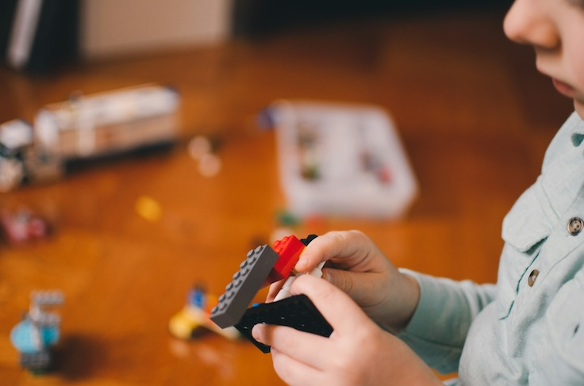

<!-- Pages subtitle -->
<h2 class="absolute top-8 right-4" >learning and teaching interdisciplinary</h2>

<!-- Banner -->
  <section id="banner">
    

      <header>
        
University of Applied Sciences Dresden

      </header>
      
This website serves as the documentation of the projects in the module Tangible Interaction at the University of Applied Sciences in Dresden.

      <ul class="actions">
        <li><a href="https://docs.google.com/presentation/d/1dQfnnQ4p35d3vIbqroQQj-R2uSmmAal-G7cSwRrMZ7M/edit?usp=sharing" class="button big">Introduction Slides</a></li>
      </ul>      
    

    
      
    
  </section>

<!-- Section -->
<section>
    View the latest projects:
    <a href="{{ 'projects' | absolute_url }}" class="button">Projects</a>
</section>